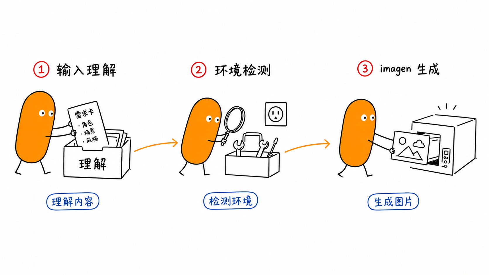
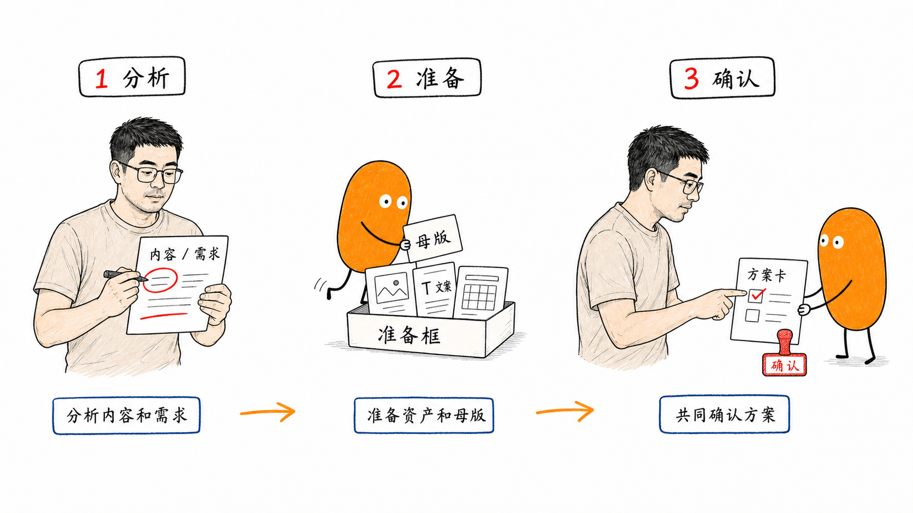

# 小石头多模式配图 Codex Skill - 飞书文档更新

## 📦 GitHub 仓库

**代码仓库**: https://github.com/yuezheng2006/xiaoshitou-scenes

[](https://github.com/yuezheng2006/xiaoshitou-scenes)

```bash
# 快速安装
git clone https://github.com/yuezheng2006/xiaoshitou-scenes.git
cd xiaoshitou-scenes
mkdir -p ~/.codex/skills
cp -R ./scene-skill-core ~/.codex/skills/
```

---

## 📖 项目简介

**scene-skill-core** 是一个面向中文内容的多模式配图 Codex Skill，使用小石头和老杨双 IP 互动，将文章、观点、流程、方法论转换成四类专业配图。

### 核心特点

1. **Profile 化设计** - IP 形象与模式解耦，支持自定义品牌 IP
2. **四种模式** - 实物图、手绘图、知识卡、PPT 演讲
3. **双 IP 互动** - 老杨主讲 + 小石头执行，自然分工
4. **Codex 原生** - 完整适配 Codex 环境和 imagen 工具
5. **质量保证** - 自动 Confirm Gate 检查，确保形象一致性

---

## 🎨 效果展示

### 1. 实物图模式 - 技术债务堆积


**场景**: 技术债务越积越多，团队重构压力大  
**模式**: 16:9 实物图  
**母版**: 04-review-rework (变异)  
**特点**: 真实物件小现场，白色背景，充足留白

### 2. 手绘图模式 - Codex Skill 工作流程



**场景**: Codex Skill 的三个阶段工作流  
**模式**: 16:9 手绘图  
**结构**: 输入理解 → 环境检测 → imagen 生成  
**特点**: 白底黑线，克制红橙蓝批注

### 3. 双 IP 模式 - 配图方案推荐



**场景**: 老杨和小石头的配图方案推荐流程  
**模式**: 16:9 手绘协作图  
**分工**: 老杨分析 + 小石头准备 + 共同确认  
**特点**: 双参考对齐，形象稳定

---

## 🚀 快速使用

### 方式 1: 单 IP 模式

```bash
codex exec "小石头实物图：用户反馈太多，团队处理不过来"
```

### 方式 2: 双 IP 模式（推荐）

```bash
codex exec "老杨：这篇关于时间管理的文章想配图

<粘贴内容>"
```

### 方式 3: 手绘图模式

```bash
codex exec "小石头手绘图：Agent 工作流的三个阶段"
```

### 方式 4: 知识卡模式

```bash
codex exec "做一张知识卡：高效会议的4个要素"
```

### 方式 5: 视频模式

```bash
codex exec "小石头视频：为什么代码审查很重要"
```

---

## 📚 核心文档

### 入口文档
- **QUICK-START.md** - 5秒决策表，环境检测，快速上手
- **SKILL.md** - 完整工作流和规则
- **README.md** - 项目总览

### 环境与工具
- **codex-environment-guidance.md** (17 KB) - Codex 环境检测与 imagen 工具规范
- **codex-exec-best-practices.md** - 实战经验与踩坑指南

### 模式文档
- **physical-style-dna.md** - 实物图视觉 DNA
- **handdrawn-style-dna.md** - 手绘图视觉 DNA
- **knowledge-card-mode.md** - 知识卡模式
- **ppt-presentation-mode.md** - PPT 演讲模式
- **video-mode.md** - 视频模式

### IP Profile
- **default-little-stone/** - 默认双 IP（小石头 + 老杨）
- **none/** - 无角色 Profile
- **mark-demo/** - 自定义品牌标示例

---

## 🎯 核心原则

### 1. 环境检测前置
- 任务开始前自动执行 4 项检测
- 确认 Codex 环境、imagen 工具、资产文件
- 失败立即停止并给出明确引导

### 2. imagen 唯一工具
- 生图必须使用 Codex 自带 imagen 工具
- 不使用外部 API（DALL-E、Midjourney）
- 支持传入本地参考图，保证形象一致性

### 3. Confirm Gate 自动化
- 生成后自动检查角色形象
- L1-L4: 四肢锚点检查
- E1-E2: 眼睛面部检查
- P1-P7: Persona 身份检查（双 IP）
- 不合格图片不交付

### 4. 内容先于画面
- 先理解处境、冲突、结构和事实
- 再选择视觉模式和母版类型
- 避免元素清单化和母版复刻化

### 5. Profile 与模式解耦
- 模式改变表达载体，不改变 IP 身份
- 支持自定义品牌 IP（Logo → 拟人设定图 → 模式校准）
- 通用规则与私有资产分离

---

## 🔧 技术架构

### 分层模型

```
用户意图 / 内容输入
    ↓
入口与模式路由层 (SKILL.md / QUICK-START.md)
    ↓
Profile 身份层 (ip-profiles/<id>/)
    ↓
模式表达层 (physical / handdrawn / knowledge-card / ppt)
    ↓
公共编排层 (story / prompt-slots / generation-templates)
    ↓
资产与参考图层 (character / persona / masters)
    ↓
生成与返修层 (Codex imagen 工具)
    ↓
质量门禁层 (Confirm Gate / Mode QA)
    ↓
交付层 (scenes / long-scroll / knowledge-card / ppt)
```

### 核心流程

1. **环境检测** - 自动执行 QUICK-START § -1
2. **内容理解** - 提取处境、动作、短标签
3. **模式选择** - 根据内容类型选择模式
4. **结构锁定** - 母版类型或结构类型
5. **Prompt 组装** - 按槽位顺序组装
6. **imagen 生成** - 传入参考图生成
7. **Confirm Gate** - 自动形象检查
8. **模式 QA** - 模式专属质量检查
9. **交付保存** - 保存到 assets/ 目录

---

## 📂 代码仓库与能力对应

> 详细文档：[CODEBASE-CAPABILITY-MAPPING.md](https://github.com/yuezheng2006/xiaoshitou-scenes/blob/main/CODEBASE-CAPABILITY-MAPPING.md)

### 仓库结构

```
xiaoshitou-scenes/
├── scene-skill-core/           # 核心 Skill（Codex 加载）
│   ├── SKILL.md                # 主工作流
│   ├── QUICK-START.md          # 5秒决策表
│   ├── references/             # 模式规则与公共编排
│   │   ├── physical-*.md       # 实物图模式
│   │   ├── handdrawn-*.md      # 手绘图模式
│   │   ├── knowledge-card-mode.md
│   │   ├── ppt-presentation-mode.md
│   │   ├── video-mode.md
│   │   ├── brand-mark-mode.md
│   │   ├── common-*.md         # 公共规则
│   │   └── codex-*.md          # 环境检测
│   ├── ip-profiles/            # IP 身份定义
│   │   ├── default-little-stone/  # 默认双 IP
│   │   ├── none/               # 无角色
│   │   └── mark-demo/          # 自定义示例
│   └── scripts/                # 视频模式脚本
├── assets/                     # 生成的图片
│   ├── showcase/               # 展示图集
│   └── masters/                # 实物图母版
└── docs/                       # 项目文档
```

### 11 个核心能力

| 能力 | 触发方式 | 核心文件 | 输出 |
|------|---------|---------|------|
| **1. 环境检测** | 自动 | QUICK-START § -1 | 检测报告 |
| **2. 实物图** | "小石头实物图：..." | physical-*.md | 16:9 PNG |
| **3. 手绘图** | "小石头手绘图：..." | handdrawn-*.md | 16:9 PNG |
| **4. 双 IP** | "老杨：..." | persona-*.md | 16:9 PNG |
| **5. 知识卡** | "做一张知识卡：..." | knowledge-card-mode.md | 3:4/4:5 PNG |
| **6. PPT** | "做一套 PPT：..." | ppt-presentation-mode.md | 多张 PNG |
| **7. 视频** | "小石头视频：..." | video-mode.md + scripts/ | MP4 |
| **8. 自定义 IP** | "用这个 Logo..." | brand-mark-mode.md | 新 Profile |
| **9. Confirm Gate** | 自动 | common-character-lock.md | 质量检查 |
| **10. 提示词组装** | 自动 | common-prompt-slots.md | 完整提示词 |
| **11. 内容提取** | 自动 | common-story-extraction.md | 视觉元素 |

### 实物图生成完整路径示例

```
用户输入: "小石头实物图：技术债务越积越多"
    ↓
环境检测 (QUICK-START § -1)
    ↓
模式路由 → physical
    ↓
读取视觉 DNA (physical-style-dna.md)
    ↓
选择母版 (physical-master-anchors.md) → 03-problem-knot-alert
    ↓
内容提取 (common-story-extraction.md)
    ↓
读取 IP (character.md)
    ↓
组装提示词 (common-prompt-slots.md)
    ↓
imagen 生成 + 传入参考图
    ↓
Confirm Gate 检查 (common-character-lock.md)
    ↓
实物图 QA (physical-qa-checklist.md)
    ↓
保存到 assets/
```

### 关键设计原则

1. **Profile 与模式解耦**
   - IP 定义在 `ip-profiles/[id]/character.md`
   - 模式规则在 `references/[mode]-*.md`
   - 通过 `common-prompt-slots.md` 组装

2. **环境检测前置**
   - `QUICK-START.md § -1` 最优先
   - Skill 加载后立即执行
   - 失败立即停止，不浪费 token

3. **Confirm Gate 自动化**
   - 生成后自动检查 L1-L4, E1-E2
   - 不合格自动返修（最多 2 次）
   - 双 IP 额外检查 P1-P7

4. **文档按需加载**
   - 只读取当前模式需要的文件
   - 节省 token，加快响应

### 代码统计

- **代码行数**: ~25,000 行
- **核心文档**: 60+ 个文件
- **IP Profile**: 3 个内置
- **模式支持**: 7 种（实物图/手绘图/知识卡/PPT/视频/自定义 IP/彩蛋长卷）
- **参考资产**: 20+ PNG 图片
- **实物母版**: 6 个（01-06）

---

## 💡 实战经验

### 关键发现 1: 会话工具加载机制

**问题**: 修改 SKILL.md 的 allowed-tools 后，当前会话无法立即使用新工具

**原因**: 会话启动时工具列表已固定，运行时不会重新读取配置

**解决**: 使用 `codex exec` 启动新会话

```bash
# ❌ 错误：期望当前会话立即获得 imagen
# 直接在当前会话中调用 imagen

# ✅ 正确：启动新会话
codex exec "小石头实物图：<内容>"
```

### 关键发现 2: 环境检测时机

**最佳实践**: 环境检测在 Skill 加载后、生成前自动执行

```text
✅ 正确流程:
  启动会话 → 加载 Skill → 读取 QUICK-START.md → 
  执行环境检测 → 确认通过 → 开始生成

❌ 错误流程:
  启动会话 → 直接生成 → 失败 → 发现环境问题
```

### 关键发现 3: 参考图传递机制

**imagen 工具支持传入本地参考图**，这是 IP 形象一致性的核心：

```python
# 单参考（小石头）
imagen(
    prompt="...",
    reference_images=[
        "scene-skill-core/.../primary-character-reference.png"
    ]
)

# 双参考（老杨 + 小石头）
imagen(
    prompt="...",
    reference_images=[
        "scene-skill-core/.../primary-character-reference.png",
        "scene-skill-core/.../author-persona-panorama.png"
    ]
)
```

### 性能数据

| 指标 | 数值 |
|------|------|
| 单张实物图 | 118K tokens, ~2分钟 |
| 3张展示图 | 117K tokens, ~5分钟 |
| 图片大小 | 1-1.5 MB (1672×941) |
| 环境检测 | 自动，<5秒 |
| Confirm Gate | 自动，每张必做 |

---

## 🎓 使用场景

### 场景 1: 技术文章配图

**输入**:
```
小石头实物图：微服务架构下的服务发现难题
```

**输出**:
- 16:9 横版实物图
- 真实物件小现场（如服务网格、路由器）
- 小石头在其中执行动作
- 2-4 个短标签

### 场景 2: 方法论讲解

**输入**:
```
老杨：把这套"目标倒推法"做成 4:5 知识卡，我主讲，小石头执行
```

**输出**:
- 4:5 竖版知识卡
- 老杨在主讲区域
- 小石头在执行模块中
- 清晰的步骤结构

### 场景 3: 流程解释

**输入**:
```
小石头手绘图：CI/CD 的五个阶段
```

**输出**:
- 16:9 手绘图
- 白底黑线结构
- 5 个核心节点
- 克制的红橙蓝批注

### 场景 4: 视频讲解

**输入**:
```
小石头视频：为什么要做代码审查
```

**输出**:
- 60-90秒视频
- 6-9 个场景插图（imagen 生成）
- TTS 旁白（Fish Audio）
- Remotion 渲染

---

## 🔥 最新更新

### 2026-07-21

#### 1. Codex 环境检测强化
- ✅ 新增环境检测清单（QUICK-START § -1）
- ✅ SKILL.md allowed-tools 添加 imagen
- ✅ 创建 codex-environment-guidance.md (17 KB)
- ✅ 创建 codex-exec-best-practices.md（实战经验）

#### 2. 视频模式上线
- ✅ 创建 video-mode.md (12.6 KB)
- ✅ 支持实物图/手绘图风格视频
- ✅ 集成 Fish Audio TTS
- ✅ Remotion 渲染引擎

#### 3. 自定义 IP 录入
- ✅ 创建 brand-mark-mode.md
- ✅ 支持 Logo/Icon → 拟人设定图 → 模式校准
- ✅ mark-demo/ 公开示例
- ✅ Profile Enrollment 状态机

#### 4. 实战验证
- ✅ 使用 codex exec 成功生成测试图
- ✅ Confirm Gate 自动验证通过
- ✅ 3 张展示图生成（117K tokens）
- ✅ 所有修改提交 GitHub

---

## 📊 项目统计

- **代码行数**: ~15,000 行（文档 + 配置）
- **核心文档**: 20+ 个 Markdown 文件
- **IP Profile**: 3 个（default / none / mark-demo）
- **模式支持**: 4 种（实物图/手绘图/知识卡/PPT）
- **扩展模式**: 视频、彩蛋长卷、自定义 IP
- **参考资产**: 10+ PNG 参考图
- **实物母版**: 6 个（01-06）
- **Git 提交**: 60+ commits
- **Token 测试**: 100K+ tokens 验证

---

## 🤝 贡献与反馈

### 贡献方式

1. **Fork 仓库** - https://github.com/yuezheng2006/xiaoshitou-scenes
2. **创建分支** - `git checkout -b feature/your-feature`
3. **提交修改** - `git commit -m "feat: your feature"`
4. **推送分支** - `git push origin feature/your-feature`
5. **创建 PR** - 在 GitHub 上创建 Pull Request

### 反馈渠道

- **GitHub Issues**: https://github.com/yuezheng2006/xiaoshitou-scenes/issues
- **飞书文档**: https://m2miovoqda.feishu.cn/wiki/KCaAwyeeaiIxiokw0T9cAwWanEe

---

## 📝 License

MIT License - 见 [LICENSE](https://github.com/yuezheng2006/xiaoshitou-scenes/blob/main/LICENSE)

角色形象边界见 [IP-NOTICE.md](https://github.com/yuezheng2006/xiaoshitou-scenes/blob/main/IP-NOTICE.md)

---

## 🙏 致谢

- **实物图/手绘图工作流**: 参考 Ian / helloianneo 的配图方法
- **知识卡/PPT 模式**: 参考 [haloshin/ip-diagram-creator](https://github.com/haloshin/ip-diagram-creator)
- **Codex 平台**: Anthropic Claude Code
- **imagen 工具**: Codex 自带图片生成工具

---

**最后更新**: 2026-07-21  
**文档版本**: v1.0  
**维护者**: [@yuezheng2006](https://github.com/yuezheng2006)
