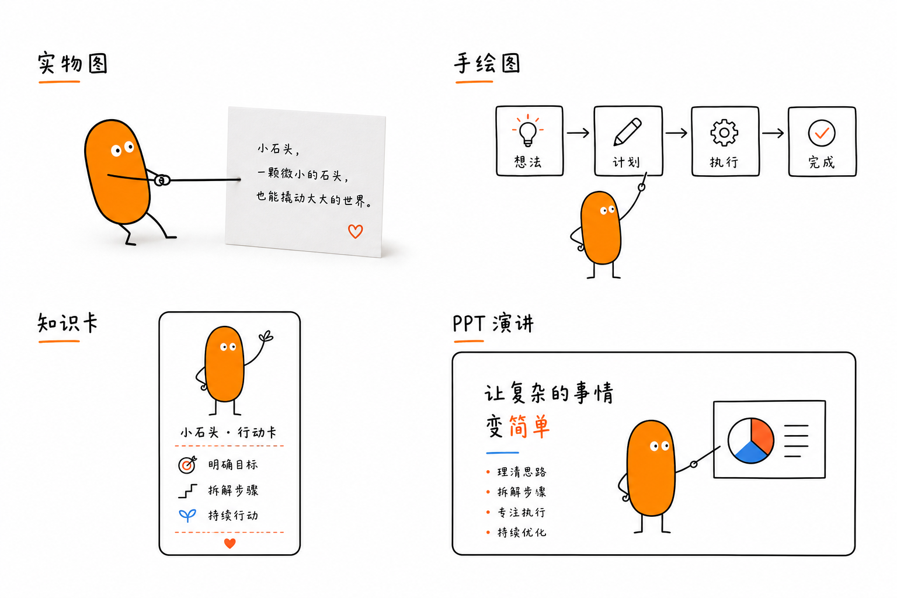
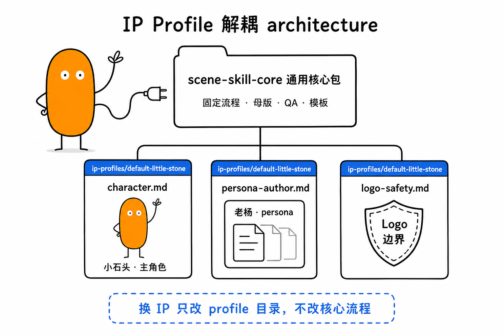
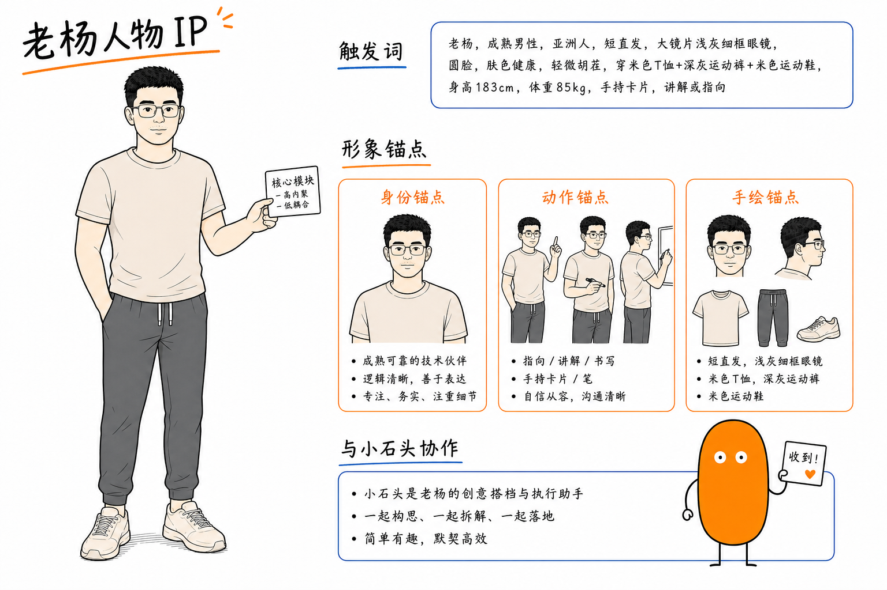

# xiaoshitou-scenes

面向中文内容的多模式配图 Codex Skill：**小石头 + 老杨双 IP 互动**，把文章、观点、流程、方法论或演讲大纲转成四类图。

**飞书知识库（完整架构说明）：** [xiaoshitou-scenes：一个可验证的视觉 Skill 仓库](https://m2miovoqda.feishu.cn/wiki/KCaAwyeeaiIxiokw0T9cAwWanEe)

核心包是 `scene-skill-core/`。默认 IP profile 是 `scene-skill-core/ip-profiles/default-little-stone/`——小石头是执行 Agent，老杨是主讲 persona；触发老杨后默认「老杨讲、小石头干」。

## 效果预览







## 快速使用

**⚠️ 环境要求**：本 Skill 必须在 **Codex 环境**中运行（Codex CLI / Codex Desktop / claude.ai/code），因为生图依赖 Codex 自带的 `imagen` 工具。详见 `scene-skill-core/references/codex-environment-guidance.md`。

安装 Skill 后，直接用中文说需求即可。

### 双 IP 入口（推荐）

```text
老杨：这篇内容想配图，请先推荐几张、什么类型。

<粘贴内容>
```

```text
老杨：把这套四步方法做成 4:5 知识卡，我主讲，小石头搬卡和标风险。
```

```text
老杨和小石头：解释这个 Agent 工作流，出一张 16:9 白板图。
```

### 小石头单 IP 入口

```text
小石头实物图：为这篇内容生成 4 张 16:9 正文配图。
```

```text
小石头手绘图：把下面的 Agent 工作流解释成一张白板图。
```

## 四种模式

| 模式 | 适合内容 |
| --- | --- |
| 实物图 | 处境、情绪、正文观点、项目故事、彩蛋长卷 |
| 手绘图 | 流程、结构、系统关系、方法论、认知拆解 |
| 知识卡 | 步骤、对比、诊断、课程总览、可收藏传播的内容 |
| PPT 演讲模式 | 直播分享、课程课件、主题演讲、案例复盘 |

实物图和手绘图是默认主力模式。知识卡和 PPT 演讲模式只在用户明确触发，或内容明显需要独立传播容器 / 整套演讲页面时使用。

## IP Profile

默认 profile：

- 入口：`scene-skill-core/ip-profiles/default-little-stone/profile.md`
- 主角色：`scene-skill-core/ip-profiles/default-little-stone/character.md`（`{IP_DESC}` / `{IP_STYLE_ADAPT}`；默认单锚点）
- **双参考（对齐老杨）**：实体 `author-persona-panorama.png`；手绘 `author-persona-panorama-handdrawn.png` + 实体 panorama；金黄金渐层猫
- 作者 persona（分层）：`persona-author.md` → identity / assets / modes / prompts
- Logo 边界：`scene-skill-core/ip-profiles/default-little-stone/logo-safety.md`

无品牌角色：`scene-skill-core/ip-profiles/none/`（触发词：不要人物 / 纯物件 / 无 IP / none）。

通用规则在 `scene-skill-core/references/`。其中 `common-prompt-slots.md` 定义槽位组装（双参考只用于对齐人）；`common-character-lock.md`、`common-persona-routing.md` 和 `common-logo-safety.md` 只描述机制，不写死具体 IP。

角色形象与 MIT 代码授权分离：见 [IP-NOTICE.md](IP-NOTICE.md)。

## 老杨 × 小石头 双 IP

默认 profile 的双 IP 分工：

```text
老杨   = 主讲 / 拆解 / 批注 / 调度
小石头 = 执行 Agent（搬卡、贴标签、标风险、物理动作）
```

触发词：`老杨`、`yuezheng2006`、`老杨和小石头`、`老杨 IP 图解`、`让我和小石头一起` 等。触发后读取 `persona-scene-patterns.md` 选六类互动场景之一；未触发时只出现小石头。

三份老杨资产 + 四层规范文档：

| 层 | 文件 |
| --- | --- |
| 入口 | `persona-author.md` |
| 身份 | `persona-author-identity.md` |
| 资产 | `persona-author-assets.md` |
| 模式 | `persona-author-modes.md` |
| 提示词 | `persona-author-prompts.md` |

PNG：`author-persona-spec.png`、`author-persona-actions.png`、`author-persona-handdrawn.png`

## 示例与资产

- 示例图库：`assets/examples/`
- 可复制提示词：`examples/usage.md`
- 试跑场景：`examples/test-scenarios.md`、`examples/test-scenarios-extended.md`
- EverOS 示例：`examples/everos.md`
- 实物图母版：`scene-skill-core/assets/masters/`

### 自定义 IP（抖音 · 拉布布）

**飞书文档 §5：** [自定义 IP 两条路径](https://m2miovoqda.feishu.cn/wiki/KCaAwyeeaiIxiokw0T9cAwWanEe) — 品牌标（抖音 Icon 拟人）+ 立绘（拉布布）

公开占位：[`mark-demo`](scene-skill-core/ip-profiles/mark-demo/) · 立绘样例：[`custom-ip-demo`](scene-skill-core/ip-profiles/custom-ip-demo/) · 交付说明：[`custom-ip-delivery.md`](examples/custom-ip-delivery.md)

```text
两张用户参考图
  → Profile Enrollment / 身份锚点确认
  → 手绘模式校准
  → 实物场景
  → 知识卡
  → 动作库
```

示例入口：[custom-ip-demo/README.md](scene-skill-core/ip-profiles/custom-ip-demo/README.md)

参考图：

- [主身份参考图](scene-skill-core/ip-profiles/custom-ip-demo/assets/reference/reference-character-primary-brown.png)
- [变体参考图](scene-skill-core/ip-profiles/custom-ip-demo/assets/reference/reference-character-variant-blue.png)

生成示例：

- [手绘模式校准](scene-skill-core/ip-profiles/custom-ip-demo/assets/examples/01-handdrawn-calibration-input-process-output.png)
- [实物场景](scene-skill-core/ip-profiles/custom-ip-demo/assets/examples/02-physical-scene-untangle-thread.png)
- [知识卡](scene-skill-core/ip-profiles/custom-ip-demo/assets/examples/03-knowledge-card-three-steps.png)
- [动作库](scene-skill-core/ip-profiles/custom-ip-demo/assets/examples/04-action-library-pull-brace-handoff.png)
- [丰富手绘动作库](scene-skill-core/ip-profiles/custom-ip-demo/assets/examples/05-handdrawn-action-library-rich.png)

该示例中的参考图包含第三方角色 / 品牌元素，仅作为用户提供的本地流程演示，不代表公开分发或商业授权。

默认 profile 的公开角色资产在：

- `scene-skill-core/ip-profiles/default-little-stone/assets/character/`
- `scene-skill-core/ip-profiles/default-little-stone/assets/persona/`

公开包不分发真实品牌 Logo。数字娱乐 / KTV / 门店经营只作为可选道具语境；需要真实 Logo 时，由用户在本地私有资产区提供并自行确认授权。

## 安装

```bash
git clone git@github.com:yuezheng2006/xiaoshitou-scenes.git
cd xiaoshitou-scenes

mkdir -p "${CODEX_HOME:-$HOME/.codex}/skills"
cp -R ./scene-skill-core "${CODEX_HOME:-$HOME/.codex}/skills/"
```

## 目录

```text
.
├── assets/                 # 公开示例与本地试跑图
├── examples/               # 可复制提示词与测试场景
├── IP-NOTICE.md            # 角色形象与 MIT 分离声明
└── scene-skill-core/        # Codex Skill 核心包
    ├── SKILL.md
    ├── assets/masters/      # 实物图母版 01-06
    ├── ip-profiles/         # 可替换 IP profile（含 none）
    ├── evals/               # 验收用例
    └── references/          # 通用流程、模式、QA、模板、槽位组装
```

## 合规

作者 persona 只使用风格化资产，不应提交真人照片。品牌 Logo、第三方商标、真实个人信息和私有资料默认不进入公开仓库。详见 [NOTICE.md](NOTICE.md)。

## 致谢

实物图 / 手绘图工作流参考 Ian / helloianneo 的配图方法；知识卡和 PPT 演讲模式参考 [haloshin/ip-diagram-creator](https://github.com/haloshin/ip-diagram-creator) 的容器型图解思路。本项目为独立整理与本地化实现，不代表上游作者参与或背书。

## License

MIT — 见 [LICENSE](LICENSE)。角色形象边界见 [IP-NOTICE.md](IP-NOTICE.md)。
